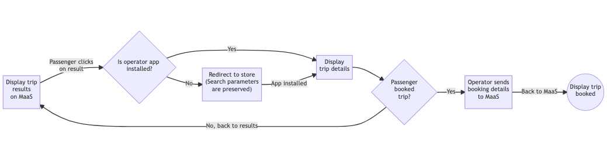

# Indroduction

## Overview

This specification provides precise guidelines for a carpooling operator and a MaaS platform to implement a "booking" flow for passengers, with information to complete the booking shared via deeplinking between the two and booking information sent back to the MaaS platform.

## Requirements Notation and Conventions

The key words "MUST", "MUST NOT", "REQUIRED", "SHALL", "SHALL NOT", "SHOULD", "SHOULD NOT", "RECOMMENDED", "NOT RECOMMENDED", "MAY", and "OPTIONAL" in this document are to be interpreted as described in [RFC 2119](http://tools.ietf.org/html/rfc2119).

# Deep-linking

## Functional specification

The booking flow with a deep link starts when a passenger clicks on a journey search result in the MaaS app. This search result MUST open the deep link contained in the [webUrl](https://github.com/fabmob/standard-covoiturage/pull/2/files#diff-c722233128f788ea06650bffef56e418732898441b4e2199997c40e9070e3345R269) parameter returned by a [Journey](https://github.com/fabmob/standard-covoiturage/pull/2/files#diff-c722233128f788ea06650bffef56e418732898441b4e2199997c40e9070e3345R220) object. This parameter MUST be provided by the carpool operator responsible for their implementation of the search API public specification. It contains the full URL and its corresponding parameters needed for the mobile device to redirect the passenger from the app displaying the search results to the operator's app or website.

If the operator is providing an app (and not a website), one obstacle to redirecting the passenger is whether they have the operator's app already installed in their mobile device or not. If not, the deep link URL SHOULD be capable of redirecting the passenger to the corresponding store instead. At the operator's discretion, this URL can also temporarily store the URL parameters for later retrieval. There are third-party services as well that can provide such a solution. This way, after the app is installed, the parameters can be recovered to automatically redirect the passenger to the booking flow as if the app had always been installed.

If the operator provides a website or if its app was already installed, then clicking on the deep link SHOULD automatically and seamlessly redirect the passenger to the operator's booking flow. It is up to the operator to decide where to start this flow and what to do with the parameters sent to the MaaS app in the search to provide the passenger with the best booking experience. It is up to the passenger to decide whether to book the clicked journey or not.

If the passenger decides not to book the journey being displayed (or if is not available anymore), the operator MAY provide the means for the passenger to go back to the search results on the MaaS app. It is then up to the passenger to decide whether to select another result and repeat the above process. If they decide to book it, it is at the operator's discretion to decide how to continue guiding the passenger through the booking process.

## Flow summary

[Source](https://mermaid-js.github.io/mermaid-live-editor/edit#pako:eNpdkVFrwjAUhf_KJU8Kur2X4VDUMdzc0Kdh9nBtrhpsk5CkG9L635e0jcj6FJpzz3fOTc1yLYhl7FDo3_yE1sPbhisI33Q3l84UeAFvpXna24klVxXexaNW8I64_YbxeNJ8onOkjmQhL2R-ToJO3sCsfnWgDVn02gIaA0HwOJHKeSwKEs_XDjhrzb7INTC__7PWDax2nG1ISEu5B6_BBSuKnMGW0OYnMGixJE-2paMlMIFP9ofEkLPvzm_V-k1Dghs8sFLPOBirgiCPsnD90DwOwaK-tYy6vdZnEmkiNVjA-CEAOFvrEewxP8eo_dY4a2B6L4Ou6nL3kVYT7IVL7lIdU5AWo7uFdw7L3mHWM-JVAy-Dwf8n63IOh1yxESvJlihFeO062nDmT1QSZ1k4CjpgiMkZV9cgrYxATwshQy6WHbBwNGJYeb29qJxl3laURHOJx7D7XnX9Az1byBY)

# Sending back booking information to the MaaS

## Information flows

The MaaS platform may need to retrieve booking data after redirecting users to the operator's application.

2 use cases are supported :

- Retrieving direct booking information linked to a specific journey on the MaaS side and on the operator side, for example for multimodal journeys reconciliation
- Retrieving all the user user carpooling usage on the MaaS side after sending the user to the carpool operator's application. In this case, the booking information is linked to the user and not a specific journey on MaaS side.

## Retrieving direct booking information

### Functional specification

The booking flow starts before the redirect to the deeplink occurs. The MaaS platform initiates a booking transaction with the operator just like in the Booking by API use cases.

Once the booking is really booked/validated on the operator side, the operator sends back the evolution of the booking status to the Maas platform.

### Technical specification

Before using the deeplink to redirect it's user, the MaaS platform SHOULD pre-initialize the booking by sending a "POST /bookings" request with status "PREINITIALIZED". The MaaS platform SHOULD ensure that the response of the operator to this request was successful before redirecting the user to the webURL.

During the booking process on the operator side, the operator SHOULD send back the evolution of the state of this booking using the "PATCH /bookings" or "PUT /bookings" endpoints.

## Retrieving all the user carpooling usage

### Functional specification

The booking feed flow starts as soon as a booking is created on the operator side. It sends booking data back to the MaaS platform. It allows the MaaS platform to support uses-cases for which booking data need to be instantly available (real-time reporting, incentive program, pricing bundles,...).

Once a booking is created, the operator SHOULD send the booking details to the MaaS platform. The operator SHOULD also notify any update of the booking to the MaaS plateform.

The passenger SHOULD have explicitely accepted that the operator shares the details of its bookings with the MaaS platform, in accordance with the applicable data-privacy regulations.

### Technical specification

The passenger MUST be authenticated in the operator plateform using an [Open ID Connect 1.0](https://openid.net/specs/openid-connect-core-1_0.html) identity layer where the Provider is the MaaS platform.

The MaaS platform MUST provide an API endpoint matching the [UPSERT_ENDPOINT_LINK_PLACEHOLDER] specification.

The operator SHOULD call the [UPSERT_ENDPOINT_LINK_PLACEHOLDER] endpoint each time a booking involving the passenger is created or the booking data have changed.
