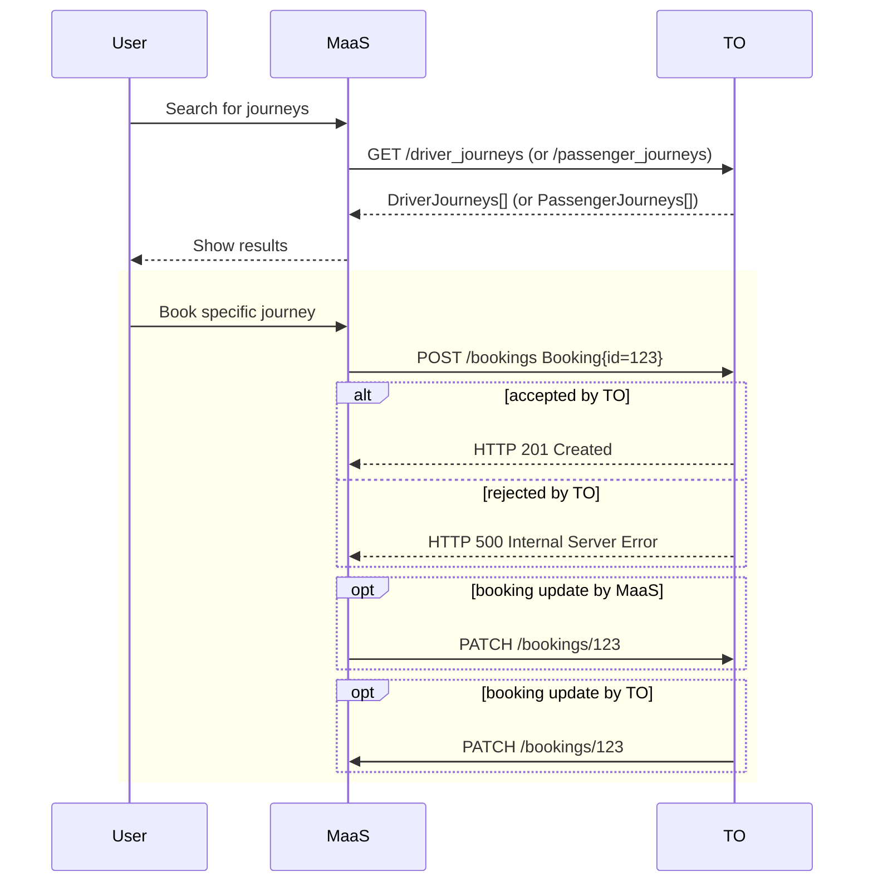
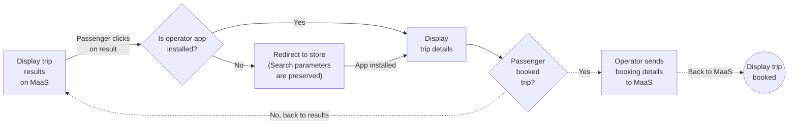

# Booking

This specifications provides two flows for implementing a booking transaction: 

- [Integrated booking by API](#integrated-booking-by-api): the initial booking 
  is handled by an API exchange between MaaS platforms and operators. Users 
  stay on their original application, without having to switch to another one, 
  and they don't need to be authenticated with the carpooling operator.
- [Delegated booking by deep link](#delegated-booking-by-deep-link): booking 
  is handled by switching applications, with a deep link to access directly
  the right page on the carpooling operator application. The user needs to 
  authenticate with the carpooling operator.

MaaS platforms and carpooling operators MUST support at least one of these two 
flows if they implement booking. They MAY implement both.

## Integrated booking by API

Integrated booking by API is one of the [two possible booking 
flows](#booking). In this booking flow, the MaaS platform initiates the 
booking and communicates his intention to the carpooling operator via the API.   
The user is not expected to be authenticated with the carpooling operator.

It is based on three endpoints : 

- `POST /bookings`: initialize the booking request
- `PATCH /bookings/{bookingID}`: modify the state of the booking status to 
  complete the booking flow 
- `GET /bookings/{bookingId}`: get the state of the booking

The following diagram shows the typical functional flow for booking by API:

### Technical specification

If the booking is made after a search, the MaaS platform SHOULD recall the 
journey IDs. TODO It is up to the carpooling operator to decide how to process 
this information, e.g for consistency checks, and how to deal with missing 
journey IDs.

A status change MUST update the `status` to a subsequent status respecting the 
following order (some statuses may be skipped): [WAITING_CONFIRMATION, 
CONFIRMED,  COMPLETED_PENDING_VALIDATION, VALIDATED, CANCELLED].  `status` 
update requests that do not comply with this rule SHOULD be dismissed by the 
MaaS platform (they may be the result of an order of receipt different from 
that of the requests sending).

## Delegated booking by deep link

Delegated booking by deep link is one of the [two possible booking 
flows](#booking). It consists in redirecting the user to another application 
to make the booking. The redirection is enabled by the `webUrl` attribute of 
any `*Journey` or `*RegularTrip` objects.  

There is no API endpoint associated to this operation.

After the booking is made, information may be made available on the MaaS 
platform if the MaaS platforms has implemented the [booking information 
feed](#booking-information-feed). Subsequent operations on the booking are 
required to be made on the carpooling operator's application, and information 
about these operations are communicated to the MaaS platform via the booking 
information feed.

### Booking information feed

The booking feed is the channel by which the carpooling operator sends back  
information to the MaaS platform, about the booking events happening on the 
carpooling operator website or app. It is therefore used in conjunction with 
delegated booking by deep link (but not indispensable).

The booking feed mechanism relies on an [Open ID Connect 
1.0](https://openid.net/specs/openid-connect-core-1_0.html) identity layer 
where the Provider is the MaaS platform, subsequently referred to as ["MaaS 
connect"](./authentication.md).

To benefit from the booking feed, the MaaS platform needs to implement the 
following endpoint:

- `POST /booking_events`

::: tip Resilience of the booking feed endpoint
The result of a valid call to the booking feed endpoint does not depend on 
precedent calls. This makes it more resilient to information losses that may 
occur.
:::

### The `CarPoolBookingEvent` object

The MaaS platform receives a `CarPoolBookingEvent` at each call to `POST 
/booking_events`.  

Each event has its unique `id`, and specifies the `idToken` to be able to link 
the event to a specific user.  

Event `data` can be either a `DriverCarpoolBooking` or a 
`PassengerCarpoolBooking`, depending on if a `DriverJourney` or a 
`PassengerJourney` has been booked.

These objects, in addition to recalling all information about the journey, 
have following additional required attributes:
* `status` specifies the booking status.
* `webUrl` is a link to the booking page on the carpooling operator's 
  application
 
The different statuses are as follows, where each update can only go to a 
subsequent item in the list:
  * **WAITING_CONFIRMATION**: the booking has not yet been confirmed by the 
    carpooling operator
  * **CONFIRMED**: the booking is confirmed
  * **COMPLETED_PENDING_VALIDATION**: the booked journey has been completed, 
    some verifications are still underway (possibly linked to the payment, the 
    anti-fraud process, etc). 
  * **VALIDATED**: the booking has been successfully completed.
  * **CANCELLED**: the booking is cancelled

::: tip Immutable attributes
Even if each booking event contains all journey information, all attributes 
except `status` of the `*Booking` object are immutable for a given booking 
"id".  Any change on these attributes requires to cancel the booking and 
create a new one.
:::

### Technical specification

#### Technical specification for the booking by deep link

The carpooling operator supporting deep linking MUST provide for each `Journey` 
shared with the MaaS platform an attribute `webUrl`, with the full URL (with 
all needed parameters) for the user's device to redirect the passenger from 
the app of the MaaS platform to the operator's app or website.

The booking flow with a deep link is initiated by the MaaS platform with a 
`*Journey` or `*RegularTrip` object provided by a carpooling operator (e.g. as 
a result of a previous search). To do that, it MUST redirect the user to the 
deep link contained in the [webUrl](TODO ) parameter.

If the operator is providing an app (and not a website), one obstacle to 
redirecting the passenger is whether they have the operator's app already 
installed in their mobile device or not. If not, the deep link URL SHOULD be 
capable of redirecting the passenger to the corresponding store instead. At 
the operator's discretion, this URL can also temporarily store the URL 
parameters for later retrieval. There are third-party services as well that 
can provide such a solution. This way, after the app is installed, the 
parameters can be recovered to automatically redirect the passenger to the 
booking flow as if the app had always been installed.

If the operator provides a website or if its app was already installed, then 
following the deep link SHOULD automatically and seamlessly redirect the 
passenger to the operator's booking flow. It is up to the operator to decide 
where to start this flow and what to do with the parameters sent to the MaaS 
app in the search to provide the passenger with the best booking experience.  

It is up to the passenger to decide whether to book the journey, any other 
journey or none.

If the passenger decides not to book the journey being displayed (or if is not 
available anymore), the operator MAY provide the means for the passenger to go 
back to the search results on the MaaS app. It is then up to the passenger to 
decide whether to select another result and repeat the above process. If they 
decide to book it, it is at the operator's discretion to decide how to 
continue guiding the passenger through the booking process.

#### Details Technical specification for the booking feed

A carpooling operator offering booking by deep link MUST accept authentication 
via "MaaS connect".

A MaaS platform SHOULD provide a "MaaS Connect" identity layer in order to get 
back information on booking events happening on the platform of the transport 
operator. In that case, it also MUST provide an API endpoint matching the 
`POST /booking_events` specification. Moreover, the passenger MUST be 
authenticated using MaaS Connect at the time of the redirection to allow the 
booking feed.

The booking feed flow starts as soon as a booking is created, regardless of 
whether the trip was first consulted on the MaaS app. It sends booking data to 
the MaaS platform. It allows the MaaS platform to support use-cases for which 
booking data need to be instantly available (real-time reporting, incentive 
program, pricing bundles,...).

If the MaaS platform is offering the `POST /booking_events` endpoint, and once 
a booking is created, the operator MUST send the booking details to the MaaS 
platform. The operator MUST also notify every `status` update of the booking 
to the MaaS plateform. As specified in [the introduction of the booking 
section](#32-booking), every other change MUST be operated by creating a new `Booking` 
object and udating the `status` of the former booking to "CANCELLED".  

A status update with the `POST /booking_events` endpoint MUST repeat the whole 
`Booking` object each time as redunduncy allows for a better resilience to 
communication failures (e.g. a status update event can be processed even if 
the booking creation event has been missed).

A status change MUST update the `status` to a subsequent status respecting the 
following order (some statuses may be skipped): [WAITING_CONFIRMATION, 
CONFIRMED,  COMPLETED_PENDING_VALIDATION, VALIDATED, CANCELLED].  `status` 
update requests that do not comply with this rule SHOULD be dismissed by the 
MaaS platform (they may be the result of an order of receipt different from 
that of the requests sending).
