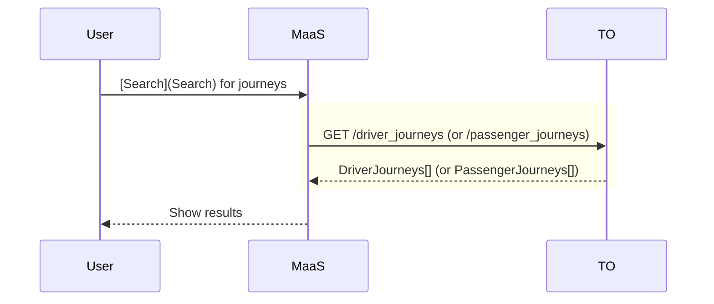

# Search

## Search for single journeys <Badge text="draft"/>

Search functionalities cover two different possible use cases: a driver can 
search for passengers (so, he searches a `PassengerJourney`), or a passenger 
can search for a driver (looking for a `DriverJourney`).

Each search has its dedicated endpoint and return value. The carpooling 
operator can implement one or the other or both following API endpoints:

- `GET /driver_journeys` and/or
- `GET /passenger_journeys`

No user information is required to perform a search.

::: tip Round trips

To search for a round trip, it is up to the MaaS platform to perform the 
searches for the outward and return journeys separately.
:::

::: tip Regular trips

Searching for regular trips has its own specific workflow presented in
[a dedicated section](#search-for-regular-trips-and-associated-journeys) 
below.
:::

### The `*Journey` objects

The `*Journey` objects come in two flavors, the `DriverJourney` and the 
`PassengerJourney`. Passengers looking for a ride will search for a 
`DriverJourney`, and drivers looking for passengers will search for a
`PassengerJourney`.

The `*Journey` object provides the necessary information to procede to the 
booking phase (TODO link). It gives the start and end positions of the shared 
journey, the expected start time and duration, the carpooling operator and 
information on the driver or passenger.

If booking by deep link is supported, the link is shared along the journey 
information in the response's attribute `webUrl`. If integrated booking by API 
is supported, then the journey information plus the `price` attribute enable 
to make a booking request.

The `price` is to be interpreted as the actual amount expected by the 
carpooling operator in case of booking by API, and a price estimate (subject 
to change) in case of bookingn via deep link.

### Technical specification

The carpooling operator MUST return at most `count` matching results, or all 
matching results if `count` parameter is not specified. All returned results 
MUST match the query parameters. If the parameter `count` is specified, the 
carpooling operator SHOULD return in priority the most relevant results. The 
measure of relevance is left to the discretion of the carpooling operator.

The `id` attribute of the response MUST be unique for a given carpooling 
operator (same `operator` attribute) among all journeys (whether 
`PassengerJourney` or `DriverJourneys`).

If no price estimate is possible, a price with `type` "UNKNOWN" SHOULD be 
returned. A journey with an unknown price is not available for integrated 
booking by API. If the `type` is "PAYING", then the attributes `amount` and 
`currency` are required.

## Search for regular trips and associated journeys <Badge text="draft"/>

A regular trip is a recurring trip that is repeated from one week to another.  

Searching for regular trips can be done with specific endpoints, which are the 
counterparts of the `GET /passenger_journeys` and `GET /driver_journeys`. The 
carpooling operator can implement one or the other or both API endpoints:

- `GET /driver_regular_trips` and/or
- `GET /passenger_regular_trips`

The API works by searching journeys that start around the same time of the day 
at given weekdays. The query parameters therefore specify an additionnal 
required `departureTimeOfDay` attribute, and an optional `departureWeekdays` 
attribute compared to the single journey search (which defaults to all days of 
the week).

Return values may only cover partially the request on the `departureWeekdays`.

### The `*RegularTrip` objects

Again, two slightly different objects can be returned depending on the 
endpoint used : a `DriverRegularTrip` or a `PassengerRegularTrip`.

These return objects share a large amount of information with the `*Journey` 
object.

But instead of giving information on a single start time, they offer a 
`schedules` attribute that details the decomposition of the regular trip into 
single journeys. Schedule information combined with regular trip attributes 
give the same level of information for the single journeys than a simple 
search would, allowing to continue to the booking phase.

For booking via deep link, an additional `webUrl` attribute is available, to 
facilitate booking journeys in bulk and avoid the bad user experience of
having to go back and forth between the MaaS the carpooling apps as many times 
as there are journeys to book.

::: tip More sophisticated regular trips

It is up to the MaaS platform to assemble the results of several calls into a 
more sophisticated regular journey.

For instance, a varying `departureTimeOfDay` depending on week day, or 
different schedules on alternating weeks, can be queried with a large 
`timeDelta` and post-filtering, or with several calls with different 
`departureTimeOfDay` and concatenation.

:::

### Technical specification

The carpooling operator MUST return at most `count` matching results, or all 
matching results if `count` parameter is not specified. All returned results 
MUST match the query parameters.

A regular trip matches the `departureWeekdays` and `departureTimeOfDay` if 
*any* journey of the regular trip matches the time and day constraint and 
starts between `minDepartureDate` and `maxDepartureDate` (included).

The returned results may not reach the `maxDepartureDate` because of the 
limited forecasting horizon of the carpooling operator.

If the carpooling operator supports booking by deep link, the `webUrl` 
attribute in the response SHOULD link to a page giving an overview of the 
regular trips (e.g. a "driver" page) and allowing to continue the process of 
regular trips by the user.
